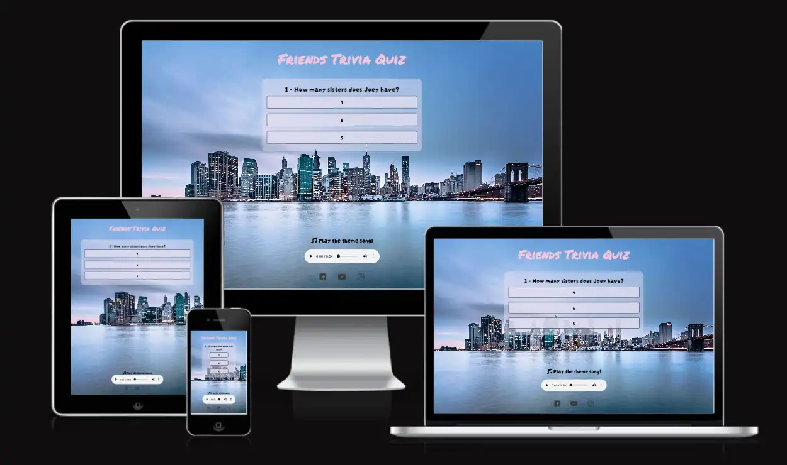
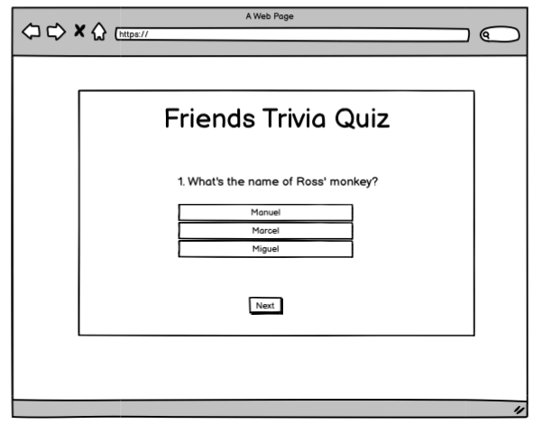
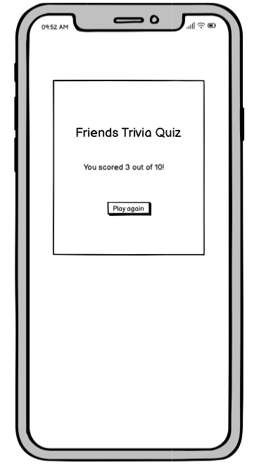
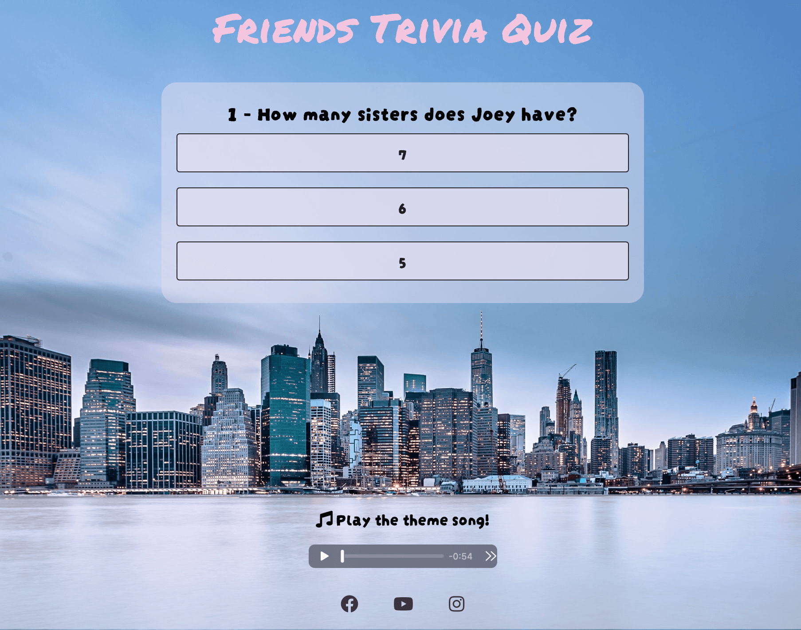
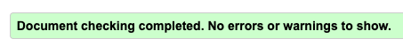
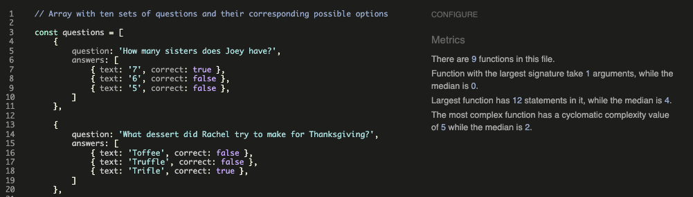
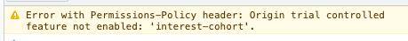

# Friends Trivia Quiz

Friends Trivia Quiz is an online game dedicated to Friends' appreciators who would like to test their knowledge on the famous TV series.

The Friends Trivia Quiz site is live, the links can be found [HERE](https://ila-bura.github.io/friends-trivia/)

## Table of Contents

- [Friends Trivia Quiz](#friends-trivia-quiz)
  - [Table of Contents](#table-of-contents)
  - [UX](#ux)
    - [Site Purpose:](#site-purpose)
    - [Site Goal](#site-goal)
    - [Audience](#audience)
    - [Communication:](#communication)
    - [Current User Goals:](#current-user-goals)
    - [New User Goals:](#new-user-goals)
    - [Future Goals:](#future-goals)
  - [Design](#design)
    - [Wireframes](#wireframes)
    - [Colour Scheme](#colour-scheme)
    - [Typography](#typography)
    - [Imagery:](#imagery)
  - [Features](#features)
    - [Existing Features:](#existing-features)
      - [Landing Page:](#landing-page)
      - [Page Title:](#page-title)
      - [Quiz Area:](#quiz-area)
      - [Final Score Screens:](#final-score-screens)
      - [Social Links:](#social-links)
    - [Features Left to Implement](#features-left-to-implement)
  - [Testing](#testing)
    - [Validator Testing](#validator-testing)
    - [Unfixed Bugs](#unfixed-bugs)
  - [Technologies Used](#technologies-used)
    - [Main Languages Used](#main-languages-used)
    - [Frameworks, Libraries \& Programs Used](#frameworks-libraries--programs-used)
  - [Deployment \& Local Development](#deployment--local-development)
    - [Deployment](#deployment)
    - [Local Development](#local-development)
      - [How to Fork](#how-to-fork)
      - [How to Clone](#how-to-clone)
  - [Testing](#testing-1)
    - [Solved Bugs](#solved-bugs)
    - [Known Bugs](#known-bugs)

## UX

### Site Purpose:

### Site Goal

### Audience

### Communication:

### Current User Goals:

### New User Goals:

### Future Goals:

## Design

### Wireframes

### Colour Scheme

Two colours were used in the creation of this site.

### Typography

The two fonts were obtained from the Google Fonts library. I chose the following three fonts for the page:

### Imagery:

All images used were created by me, and styled to give it the feel of an interactive colouring book.

## Features

### Existing Features:

#### Landing Page:

#### Page Title:

#### Quiz Area:

#### Final Score Screens:

#### Social Links:

### Features Left to Implement

## Testing

### Validator Testing

- The html file passed through the [W3C validator](https://validator.w3.org/) with no issues found.

- The CSS file passed through the [Jigsaw validator](https://jigsaw.w3.org/css-validator/) with no issues found.

- The JS file passes through [JSHint](https://jshint.com/) with no issues found.

- The page has an excellent Accessibility rating in Lighthouse

- Tested the site opens in Brave, Chrome & Safari without issues.
- All links open to external pages as intended.

### Unfixed Bugs

## Technologies Used

### Main Languages Used

- HTML5
- CSS3
- Javascript

### Frameworks, Libraries & Programs Used

- [Am I Responsive?](http://ami.responsivedesign.is/) To show the website image on a range of devices.

- [Balsamiq](https://balsamiq.com/) - Used to create wireframes.

- [Birme](https://www.birme.net/) To resize images and convert to webp format.

- [Favicon.io](https://favicon.io/) To create favicon.

- [Git](https://git-scm.com/) - For version control.

- [Github](https://github.com/) - To save and store the files for the website.

- [GitPod](https://gitpod.io/) - IDE used to create the site.

- [Google Developer Tools](https://developers.google.com/web/tools) - To troubleshoot and test features, solve issues with responsiveness and styling.

- [Google Fonts](https://fonts.google.com/) - To import the fonts used on the website.

- [TinyPNG](https://tinypng.com/) To compress images

## Deployment & Local Development

### Deployment

The site is deployed using GitHub Pages

To Deploy the site using GitHub Pages:

1. Login (or signup) to Github.
2. Go to the repository for this project, [Ila-bura/friends-trivia](https://github.com/Ila-bura/friends-trivia).
3. Click the settings button.
4. Select pages in the left hand navigation menu.
5. From the source dropdown select main branch and press save.
6. The site has now been deployed, please note that this process may take a few minutes before the site goes live.

### Local Development

#### How to Fork

To fork the repository:

1. Log in (or sign up) to Github.
2. Go to the repository for this project, [Ila-bura/friends-trivia](https://github.com/Ila-bura/friends-trivia)
3. Click the Fork button in the top right corner.

#### How to Clone

To clone the repository:

1. Log in (or sign up) to GitHub.
2. Go to the repository for this project, [Ila-bura/friends-trivia](https://github.com/Ila-bura/friends-trivia)
3. Click on the code button, select whether you would like to clone with HTTPS, SSH or GitHub CLI and copy the link shown.
4. Open the terminal in your code editor and change the current working directory to the location you want to use for the cloned directory.
5. Type 'git clone' into the terminal and then paste the link you copied in step 3. Press enter.

## Testing

Please refer to [TESTING.md](TESTING.md) file for all testing carried out.

### Solved Bugs

### Known Bugs

- A warning message is displayed in the console on the live page when testing with Lighthouse. After researching the matter, the error appears to be related to teh fact that GitHub hosted pages disable Google's 3rd party cookie alternative FLoC, which then throws this error. The error doesn't affect the website in any way.

  
