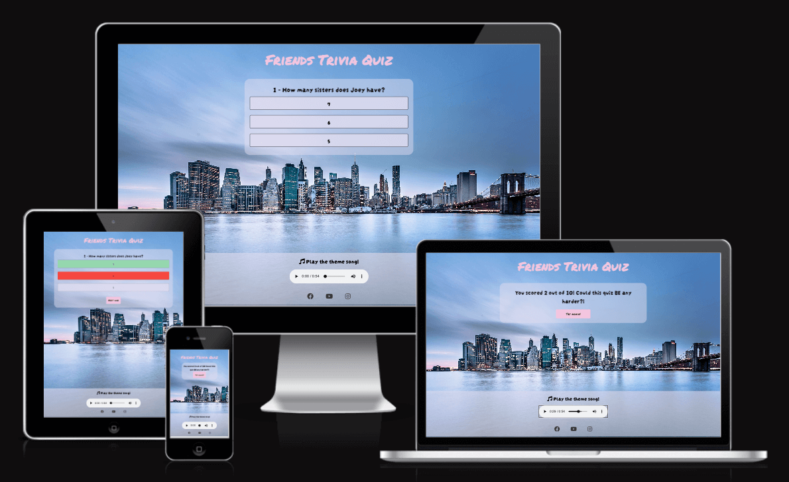
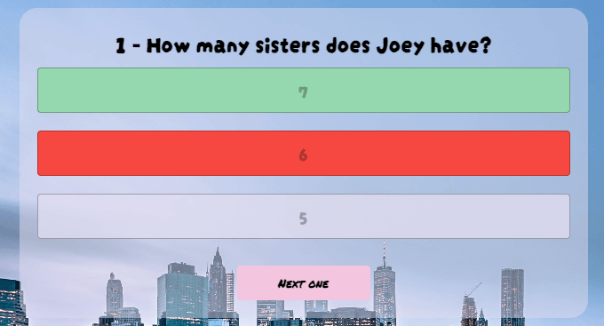
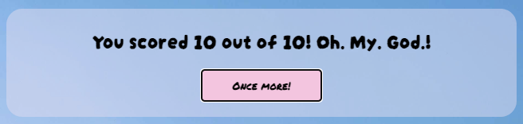
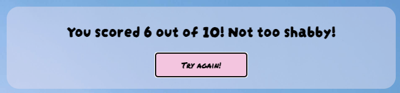
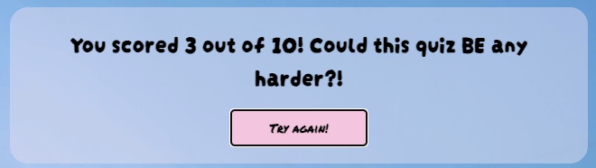
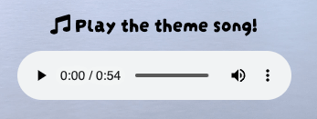
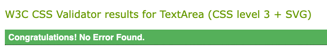
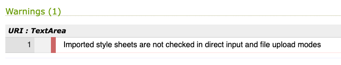
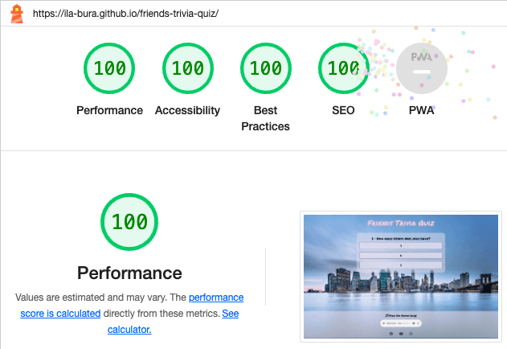
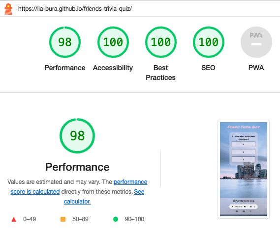

# Friends Trivia Quiz

Friends Trivia Quiz is an online game dedicated to Friends' fans and appreciators who would like to test their knowledge on the famous TV series.

The Friends Trivia Quiz site is live, the links can be found [HERE](https://ila-bura.github.io/friends-trivia-quiz/)

## Table of Contents

- [Friends Trivia Quiz](#friends-trivia-quiz)
  - [Table of Contents](#table-of-contents)
  - [UX](#ux)
    - [Site Purpose](#site-purpose)
    - [Audience](#audience)
    - [Communication](#communication)
    - [User Goals](#user-goals)
    - [Future Goals](#future-goals)
  - [Design](#design)
    - [Wireframes](#wireframes)
    - [Colour Scheme](#colour-scheme)
    - [Typography](#typography)
    - [Imagery](#imagery)
  - [Features](#features)
    - [Existing Features](#existing-features)
      - [Landing Page](#landing-page)
      - [Quiz Area](#quiz-area)
      - [Final Score Screens](#final-score-screens)
      - [Audio Player](#audio-player)
      - [Social Links](#social-links)
    - [Features Left to Implement](#features-left-to-implement)
  - [Testing](#testing)
    - [Manual Testing](#manual-testing)
    - [Validator Testing](#validator-testing)
  - [Technologies Used](#technologies-used)
    - [Main Languages Used](#main-languages-used)
    - [Frameworks, Libraries \& Programs Used](#frameworks-libraries--programs-used)
  - [Deployment \& Local Development](#deployment--local-development)
    - [Deployment](#deployment)
    - [Local Development](#local-development)
      - [How to Fork](#how-to-fork)
      - [How to Clone](#how-to-clone)
  - [Testing](#testing-1)
    - [Solved Bugs](#solved-bugs)
    - [Known Bugs](#known-bugs)
  - [Credits](#credits)
    - [Images](#images)
    - [Code](#code)
    - [Others](#others)

## UX

### Site Purpose

The quiz is designed to challenge users with ten questions about the TV series Friends. For each question, the user will be able to verify immediately if they got it right and if that is not the case, the correct answer is highlighted. Along with the final score, a message is displayed to congratulate the users or encourage them to take the quiz again to better their score.

### Audience

Anyone who has watched a few episodes of the show and wants to test how much they remember about a few fun facts.

### Communication

The overall design was kept extremely simple on purpose: the user is encouraged to start the quiz as soon as they open the landing page. The visual structure of the quiz makes it intuitive to go through the ten questions.

### User Goals

Challenge the user to test their knowledge and find the correct answers to the quiz. Entertain the players with a short snippet of music playing the theme song. If they wish to retake the quiz at the end to better their score, a button is displayed to start the quiz again.

### Future Goals

Add more questions to the quiz, possibly with different levels of difficulty to suit a broader audience. The user would also be more engaged to complete the quiz if a timer was displayed with limited amount of time to answer each question.

## Design

### Wireframes

### Colour Scheme

The colours used for the design of this site were selected using the Chrome extension ColorZilla to match the exact shades of pink and light blue in the background picture. The green and red shades chosen for the buttons displaying the correct and incorrect answers were sourced from Coolors.

### Typography

The two fonts were sourced from the Google Fonts library:

- Darumadrop One for the main heading and the Next One button, as it vaguely reminds of the actual font of the Friends logo;
- Permanent Marker for the body of the page.

### Imagery

The background image of New York by night was sourced from Pexels and the author is 

## Features

### Existing Features

#### Landing Page

#### Quiz Area

There are three options to choose from for each question. Once the user clicks on one of them, the code prevents them from selecting any other option and at the same time, the correct answer will be highlighted in green. If the user picks an incorrect answer, the corresponding button will be highlighted in red.

#### Final Score Screens

Once the user has answered the last question, the final score is displayed. The user is also presented with three different messages, depending on their final score. This was achieved by writing a nested if/else statement.

#### Audio Player

The user has the option to play the theme song while they play. The embedded media player displays the controls so that the user can adjust the volume and stop the music at any time. It is worth noting that the music does not play authomatically and the loop option was avoided.

#### Social Links

In the footer area the social media links of Facebook, YouTube and Instagram serve the purpose of giving the user the chance to potentially reach out and connect with the author of the site.

### Features Left to Implement

In future iterations, some additional features could include giving the user the option to select multiple levels of difficulty and a timer to make the quiz more challenging.

## Testing

### Manual Testing

| Test                                                                                                                                                             | Expected                                                                                                                                                                                                   | Outcome     |
| :--------------------------------------------------------------------------------------------------------------------------------------------------------------- | :--------------------------------------------------------------------------------------------------------------------------------------------------------------------------------------------------------- | :---------- |
| Open landing page                                                                                                                                                | An event listener waits for the DOM to finish loading before running the quiz. The first question and three options are displayed.                                                                         | As Expected |
| Select the correct answer                                                                                                                                        | The correct answer button turns green. The other two options are greyed out and cannot be selected. The Next One button is displayed.                                                                      | As Expected |
| Click on the Next One button                                                                                                                                     | The quiz area is cleared. The subsequent question is displayed together with the three possible answers. The numbering of the questions has increased by one. The Next One button is not displayed.        | As Expected |
| Select an incorrect answer                                                                                                                                       | The selected incorrect answer turns red. The correct answer button turns green. The other option is greyed out and cannot be selected. The Next One button is displayed.                                   | As Expected |
| Select a random answer to the last question and click the Next One button.                                                                                       | The quiz area is cleared. The final score is displayed as well as a short message commenting the result. The Next One button turns into a button nudging the user to try the quiz again.                   | As Expected |
| Click on the Try Again button                                                                                                                                    | The landing page is loaded and the first question is displayed in the quiz area along with the three options.                                                                                              | As Expected |
| Play the quiz from the top by selecting random answers one after the other until the last one.                                                                   | The numbering of the questions systematically increases by one.                                                                                                                                            | As Expected |
| Play the quiz from the top by selecting the ten correct answers one after the other until the last one then click the Next One button.                           | The quiz area is cleared. The final score displayed reads the following message: "You scored 10 out of 10! Oh.My.God.!". The Next One button turns into a button that reads "Once More!"                   | As Expected |
| Play the quiz from the top by selecting more than five correct answers (six, for example) one after the other until the last one then click the Next One button. | The quiz area is cleared. The final score displayed reads the following message: "You scored 6 out of 10! Not too shabby!". The Next One button turns into a button that reads "Try again!".               | As Expected |
| Play the quiz from the top by selecting less than six correct answers (five, for example) one after the other until the last one then click the Next One button. | The quiz area is cleared. The final score displayed reads the following message: "You scored 5 out of 10! Could this quiz BE any harder?". The Next One button turns into a button that reads "Try again!" | As Expected |

### Validator Testing

- The HTML file passed through the [W3C validator](https://validator.w3.org/) with no issues found.

- The CSS file passed through the [Jigsaw validator](https://jigsaw.w3.org/css-validator/) with no issues found.

A warning was displayed. After reasearching the matter on [StackOverflow](https://stackoverflow.com/questions/25946111/importing-css-is-ending-up-with-an-error) it appears to be related to the use of Google Fonts import link in the CSS file. It is my understanding that this is W3C validator informing that it is not going to validate Google's imported stylesheet. No errors or similar warnings are displayed in the console using Chrome developer tools, therefore no action was taken as the site is not affected at all by this warning.

- The JS file passed through [JSHint](https://jshint.com/) with no issues found.

- The page has an excellent Accessibility rating in Lighthouse for both Desktop and Device.

- The site was tested in Chrome and Safari without issues.
- All links open to external pages as intended.

## Technologies Used

### Main Languages Used

- HTML5
- CSS3
- Javascript

### Frameworks, Libraries & Programs Used

- [Am I Responsive?](http://ami.responsivedesign.is/) To show the website image on a range of devices.

- [Balsamiq](https://balsamiq.com/) - Used to create wireframes.

- [Birme](https://www.birme.net/) To resize images and convert to webp format.

- [ColorZilla](https://www.colorzilla.com/) To pick specific shades of colour from the background image.

- [Coolors](https://coolors.co/) - To select the shades for the correct and incorrect answers.

- [Favicon.io](https://favicon.io/) To create favicon.

- [FreeConvert](https://www.freeconvert.com/convert/video-to-mp3) to convert a YouTube video to mp3 file.

- [Git](https://git-scm.com/) - For version control.

- [Github](https://github.com/) - To save and store the files for the website.

- [GitPod](https://gitpod.io/) - IDE used to create the site.

- [Google Developer Tools](https://developers.google.com/web/tools) - To troubleshoot and test features, solve issues with responsiveness and styling.

- [Google Fonts](https://fonts.google.com/) - To import the fonts used on the website.

- [Pexels](https://www.pexels.com/) - To source the background picture.

- [TinyPNG](https://tinypng.com/) - To compress images

## Deployment & Local Development

### Deployment

The site is deployed using GitHub Pages

To Deploy the site using GitHub Pages:

1. Login (or signup) to Github.
2. Go to the repository for this project, [Ila-bura/friends-trivia-quiz](https://github.com/Ila-bura/friends-trivia-quiz).
3. Click the settings button.
4. Select pages in the left hand navigation menu.
5. From the source dropdown select main branch and press save.
6. The site has now been deployed. This process may take a few minutes before the site goes live.

### Local Development

#### How to Fork

To fork the repository:

1. Log in (or sign up) to Github.
2. Go to the repository for this project, [Ila-bura/friends-trivia-quiz](https://github.com/Ila-bura/friends-trivia-quiz)
3. Click the Fork button in the top right corner.

#### How to Clone

To clone the repository:

1. Log in (or sign up) to GitHub.
2. Go to the repository for this project, [Ila-bura/friends-trivia](https://github.com/Ila-bura/friends-trivia-quiz)
3. Click on the code button, select whether you would like to clone with HTTPS, SSH or GitHub CLI and copy the link shown.
4. Open the terminal in your code editor and change the current working directory to the location you want to use for the cloned directory.
5. Type 'git clone' into the terminal and then paste the link you copied in step 3. Press enter.

## Testing

### Solved Bugs

While writing the code to implement the Next One button I came across the following error: ["TypeError: Cannot set properties of null"](https://bobbyhadz.com/blog/javascript-cannot-set-property-innerhtml-of-null). After researching the issue online, I identified the reason and fixed it: The Next One button had a "btn-next" class instead of a "btn-next" id.

### Known Bugs

- A warning message is displayed in the console on the live page when testing with Lighthouse. After researching the matter on [StackOverflow](https://stackoverflow.com/questions/69619035/error-with-permissions-policy-header-unrecognized-feature-interest-cohort), the error appears to be related to the fact that GitHub hosted pages disable Google's third party cookie alternative FLoC, which throws this error. The error does not affect the website in any way.

  

## Credits

### Images

- The background image of New York by night was sourced from Pexels and the author is 

### Code

- The basic structure of the quiz code used was inspired by YouTube videos by [Easy Tutorials](https://www.youtube.com/watch?v=PBcqGxrr9g8) and [Web Dev Simplified](https://www.youtube.com/watch?v=riDzcEQbX6k)
- A few tricks implemented in the code were inspired by A. Grieves' Love Maths Walkthrough Project from Code institute.

### Others

- Some of the quiz questions were sourced from two online quizzes: [The Ultimate "Friends" Trivia Quiz](https://www.seventeen.com/celebrity/celeb-quizzes/a25048028/friends-quiz-trivia/) and [52 Question Ultimate Friends Trivia Quiz!](https://www.beano.com/posts/the-ultimate-friends-trivia-quiz)
- The song played in the snippet is "I'll be There for you" by The Rembrandts. The [YouTube video](https://www.youtube.com/watch?v=s2TyVQGoCYo) was converted into mp3 file using FreeConvert.
- A special acknowledgment to my mentor, Martina Terlevic, for the support and encouragement.
